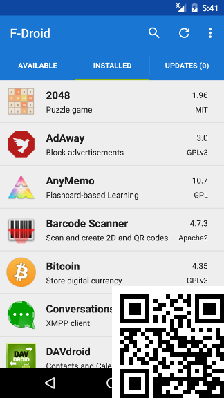

## What is F-Droid?

F-Droid is an [installable](https://f-droid.org/FDroid.apk) catalogue of FOSS (Free and Open Source Software) applications for the Android platform. The client makes it easy to browse, install, and keep track of updates on your device.

**[DOWNLOAD F-DROID](https://f-droid.org/FDroid.apk){:class="material-button"}**
