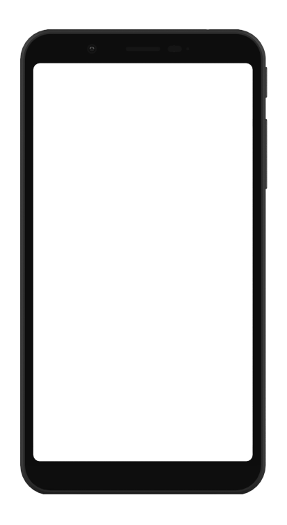



<h2>{{strings.title}}</h2>

{{strings.introduction}}

    

        

            <a class="material-button" href="https://f-droid.org/FDroid.apk">{{ strings.download_fdroid }}</a>
        

        

            <a href="https://f-droid.org/FDroid.apk.asc">{{ strings.gpg_signature }}</a>
        

        

            
        

    

    

        
    

